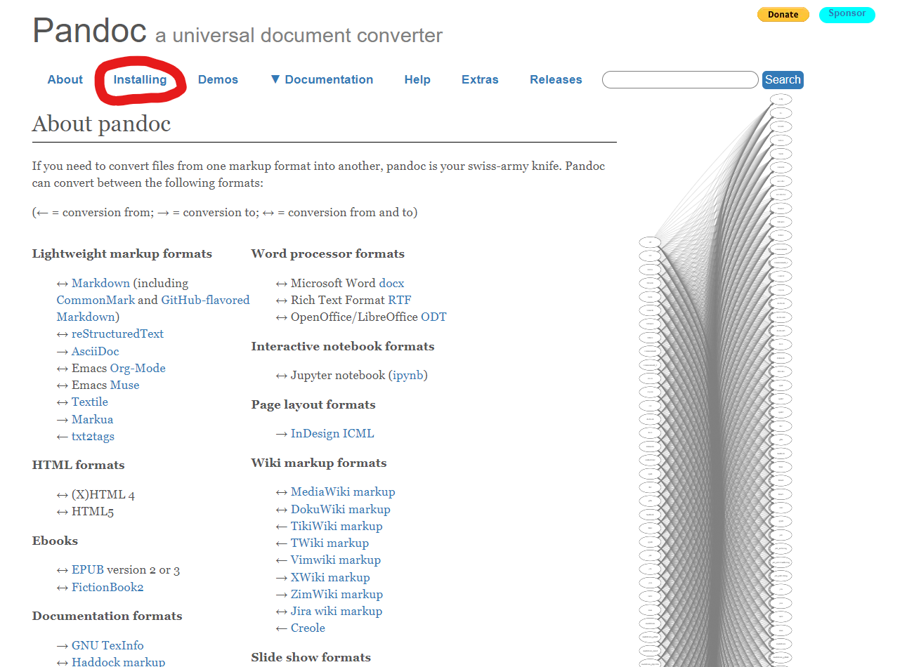
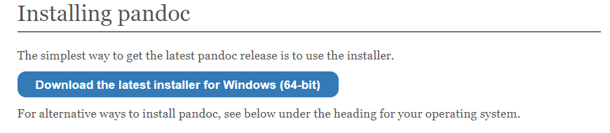
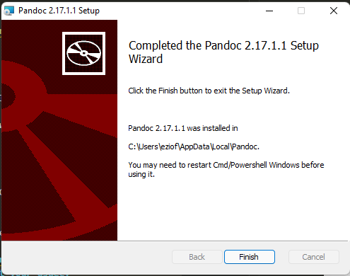
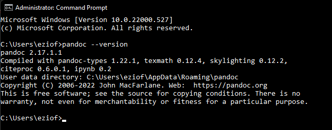

# How to Download and Install Pandoc

## Introduction

The best way to easily convert Word files to Markdown is Pandoc: a universal document coverter. However, before you can start converting, it's important to make sure you've properly downloaded and installed Pandoc, which you'll have done by the end of this guide. All you will need for this guide a computer with which to install Pandoc on.

## Instructions

1. Navigate to the official pandoc website, [pandoc.org](pandoc.org).

<figure>

<figcaption>Figure 1: The official pandoc website and where to find the "installing tab"</figcaption>
</figure>

1. Once you are on the pandoc website, click on the "Installing" tab.

<figure>

<figcaption>Figure 2: Pandoc website's download screen</figcaption>
</figure>

2. Once on the "Installing pandoc" page, click the Download button.
    
    **Note: the blue download button will be tuned to your respective operating system.**

3. The pandoc installer file will begin to download. Open the installer file from where you have downloaded it.

4. Once you've opened the pandoc installer, accept the terms of agreement and press install.
    
    **Note: Pandoc may ask to install for all users on the system. You can decide whether or not  to select this. It will not impact your usage.**

5. Upon finishing the installation, you will be shown the screen pictured in the below figure, letting you know you've finished. You can press the finish button.

<figure>

<figcaption>Figure 3: Finish screen of pandoc installer."</figcaption>
</figure>

6. You've successfully installed pandoc! To confirm you've successfully installed pandoc, first open the terminal. You can do this on Windows by pressing the Windows button, typing "Command Prompt", and clicking on the first result. You can do this similarly on MacOS by searching "Terminal" instead of "Command Prompt"

7. With the terminal open, type the command ```pandoc --version```, and hit enter. If your pandoc installation was sucessful, you will see an output  similar to the one pictured below.

<figure>

<figcaption>Figure 4: Expected output in command prompt"</figcaption>
</figure>

