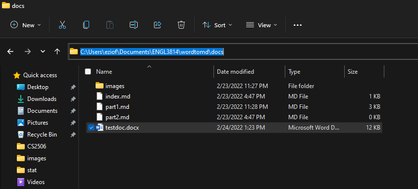
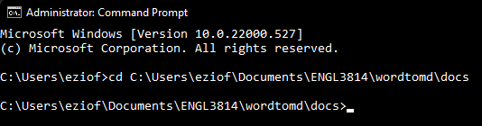

# How to Convert Word Files to Markdown using Pandoc

## Introduction

Now that you've fully downloaded and installed Pandoc, you have all the tools necessary for file converstion. You will need both a word document to convert and you will need to have installed Pandoc onto your machine. By the end of this guide, you will be able to fully convert Microsoft Word files to Markdown files using Pandoc.

## Instructions

1. First, find where your desired Word file to convert is using the File Explorer application according to your operating system.

2. Once you've found your file, make note of its filepath.
   
   **NOTE: If you're not sure how to find your file's file path, it's location will be in the search bar once clicked, as pictured below.**

<figure>

<figcaption>Figure 1: Example File Location.</figcaption>
</figure>

1. Once you've made note of your file's filepath, open your terminal application. You can do this on Windows by pressing the Windows button, typing "Command Prompt", and clicking on the first result. You can do this similarly on MacOS by searching "Terminal" instead of "Command Prompt"

2. With your terminal window open, type in the command ```cd [FILEPATH]```, with the filepath noted earlier, as shown in the figure bwlow. This will direct your terminal to your file's location.

<figure>

<figcaption>Figure 2: Example cd command on terminal.</figcaption>
</figure>

3. At this point, enter this command with the following syntax into the terminal: ```pandoc -s [INPUT_FILENAME] -t markdown --extract-media=images -o [OUTPUT_FILENAME]```. With this, your converted markdown file will be in the same location as your word document.

